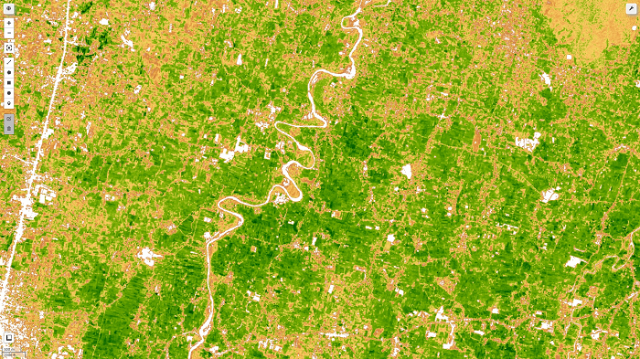
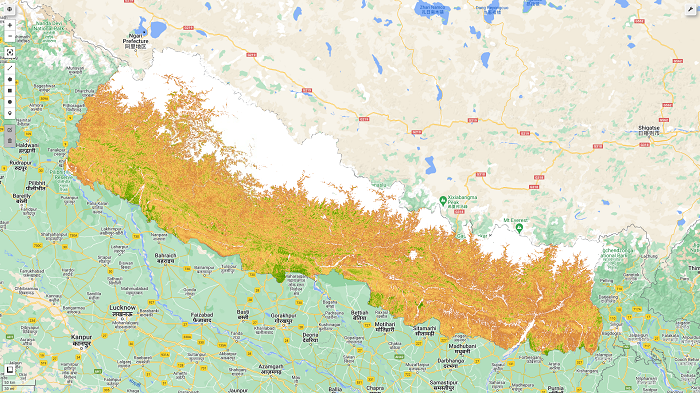

# Blog Post from Kafle Krishna

I have explained and demostrated the use case in following blog. Please do visit the blog for details and give feedback if you have any.
https://kaflekrishna.com.np/blog-detail/retrieving-leaf-area-index-lai-sentinel-2-image-google-earth-engine-gee/

## Retrieving Leaf Area Index (LAI) with Sentinel 2 image with Google Earth Engine (GEE):

The leaf area index (LAI), equal to half of the total green leaf area per unit of the horizontal ground surface, is a crucial structural feature of vegetation. Canopy interception, evapotranspiration, and gross photosynthesis are directly related to LAI since leaf surfaces constitute the primary frontier of energy and mass exchange.

### Post follows:
Google Earth Engine with python Api.

#### Expected Output of code is as follows:
 

