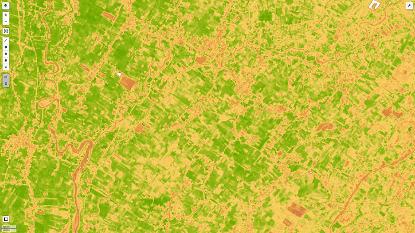
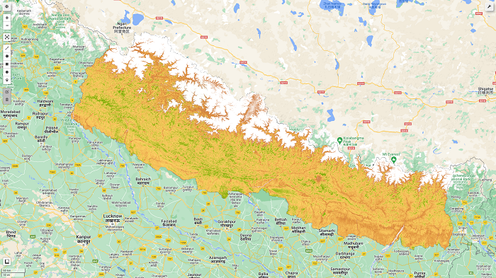

Blog Post from Kafle Krishna

I have explained and demostrated the use case in following blog. Please do visit the blog for details and give feedback if you have any.
https://kaflekrishna.com.np/blog-detail/calculating-ndvi-sentinel-2-images/

Output for the code is expected to be:
 

