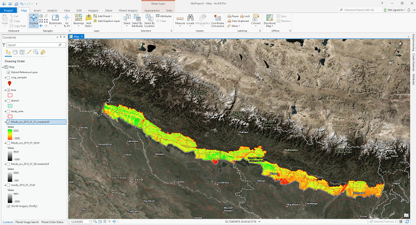

# Blog Post from Kafle Krishna

I have explained and demostrated the use case in following blog. Please do visit the blog for details and give feedback if you have any. https://kaflekrishna.com.np/blog-detail/calculating-different-vegetation-indices-google-earth-engine-sentinel-2-images/

## Downloading images from Google Earth Engine to local drive ( A case study for Timesat image Preparation for Planting Date)
Satellite image processing might be very painful, depending upon the volume of data. I don't like to be suggesting the data download and do image analysis on your local device. But there might be a time when we can't follow this suggestion. I passed through a similar situation for analyzing MODIS EVI datasets to determine the planting date for Rice. I was advised to use Timesat (Welcome to the TIMESAT pages! (lu.se)) for this task. Instead, I had no options to download MODIS EVI data (250 m resolution, 8 Day temporal resolution-terra and Aqua sensors combined). I used Google Earth Engine (GEE) to download the data into my local device and prepare the dataset in the desired format for Timesat (A software package to analyze time-series of satellite sensor data). I would never suggest downloading the Satellite data unless absolutely necessary. This article will be the perfect solution for those looking for a way to download satellite images from Google Earth Engine (GEE). But I have not yet tested this for large images; that might not be possible due to GEE restriction and is not recommended. 

#### Expected Output of code is as follows:
