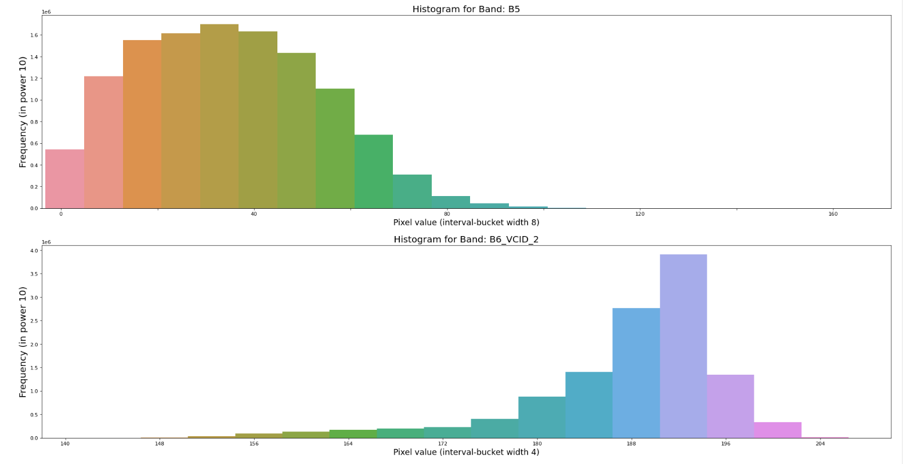
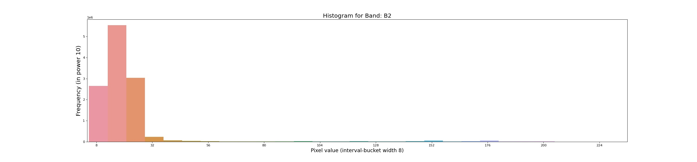
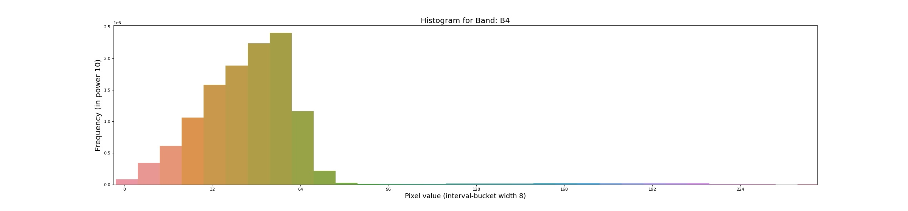
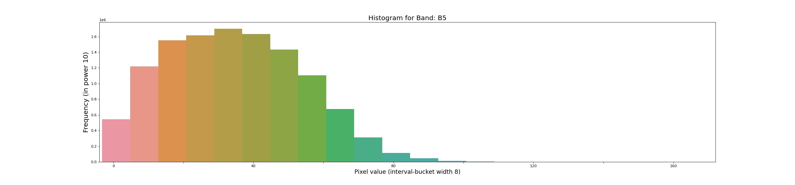
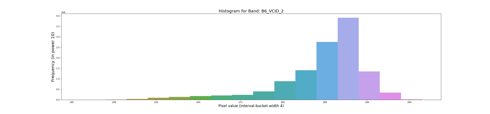
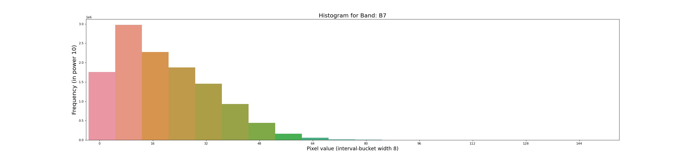

# Blog Post from Kafle Krishna

I have explained and demostrated the use case in following blog. Please do visit the blog for details and give feedback if you have any.
https://kaflekrishna.com.np/blog-detail/histogram-image-google-earth-engine-gee-python-api/

## Histogram from the Image on Google Earth Engine (GEE) with python API

When presenting and summarizing discrete or continuous data, histogram is the chart you are looking for. By displaying the amount of data points that fall inside a given range of values (referred to as "bins or interval" or "buckets"),

Image Histogram on Google Earth Engine (GEE):
The official documentation for creating histogram chart can be found here. But this can be only used on the code editor but not on the python API. For Python api, I am going to use reducer function: ee.Reducer.histogram. It will create a reducer that will compute a histogram of the inputs (shapefile as area of interest).

#### Expected Output of code is as follows:
 

Histogram for Band 1

Histogram for Band 2

Histogram for Band 3

Histogram for Band 4

Histogram for Band 5

Histogram for Band 6

Histogram for Band 7
