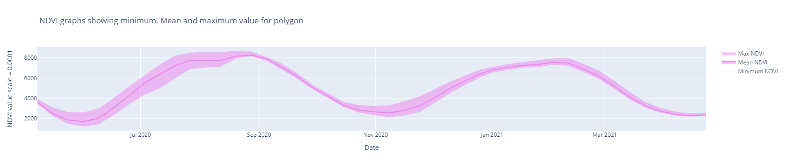

# Blog Post from Kafle Krishna

I have explained and demostrated the use case in following blog. Please do visit the blog for details and give feedback if you have any.
https://kaflekrishna.com.np/blog-detail/minimum-mean-and-maximum-ndvi-values-polygon-samples-google-earth-engine-python-api/

## Minimum, Mean and Maximum NDVI values for Polygon samples on Google Earth Engine (Python API)

We have multiple crop samples as a polygon. We must inspect the sample with time series NDVI, EVI, or Band values. We also need Minimum, Mean and maximum values to present us with the insight and information polygon sample. This information benefits us as we can decide whether the polygon sample is giving a representative area or not. And we can adjust our sample accordingly.

#### Expected Output of code is as follows:
 

