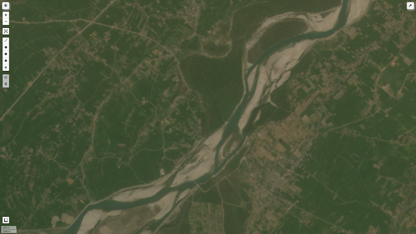
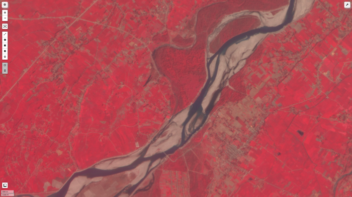
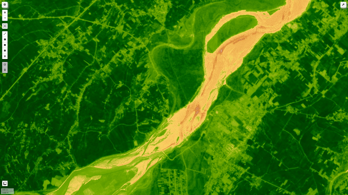

# Blog Post from Kafle Krishna

I have explained and demostrated the use case in following blog. Please do visit the blog for details and give feedback if you have any.
https://kaflekrishna.com.np/blog-detail/accessing-planets-imagery-nicfis-analysis-google-earth-engine-gee/

## Accessing the Planet's imagery (NICFI's) for analysis from Google Earth Engine (GEE)

Users can now access Planet's high-resolution, analysis-ready mosaics of the world's tropics through Norway's International Climate & Forests Initiative (NICFI) with an objective to help reduce and reverse the loss of tropical forests, combat climate change, conserve biodiversity, and facilitate sustainable development for non-commercial purposes.

This program is launched in partnership with Norway's International Climate and Forest Initiative (NICFI), Kongsberg Satellite Services (KSAT), and Planet. 

#### Expected Output of code is as follows:
 

