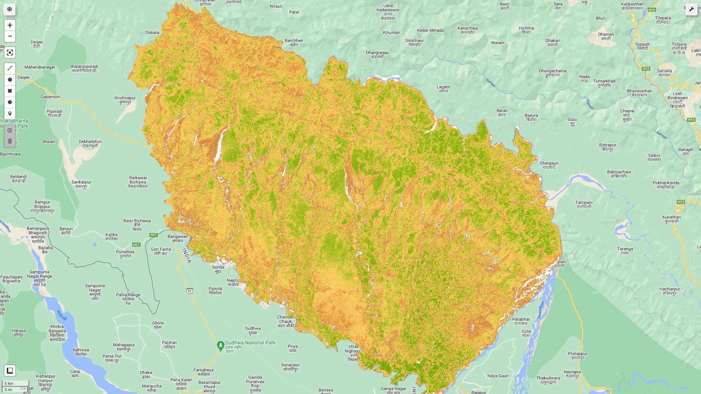

# Blog Post from Kafle Krishna

I have explained and demostrated the use case in following blog. Please do visit the blog for details and give feedback if you have any. https://kaflekrishna.com.np/blog-detail/calculating-different-vegetation-indices-google-earth-engine-sentinel-2-images/

## Calculating different Vegetation Indices in Google Earth Engine (Sentinel -2 images)
In previous post, I have published the article for EVI and NDVI calculation from sentinel 2 image on Google earth engine (GEE) platform. In this article, I will be showing how various vegetation indices can be computed on GEE platforms and can be added to image collection. So, let's dive into various vegatation indices directly. 
- Greenness (Green Leaf Index)
- Soil-Adjusted Vegetation Index (SAVI)
- Green Chlorophyll Index (GCI )
- SIPI (Structure Insensitive Pigment Index)
- ARVI (Atmospherically Resistant Vegetation Index)
- NBRI (Normalized Burned Ratio Index)

#### Expected Output of code is as follows:
